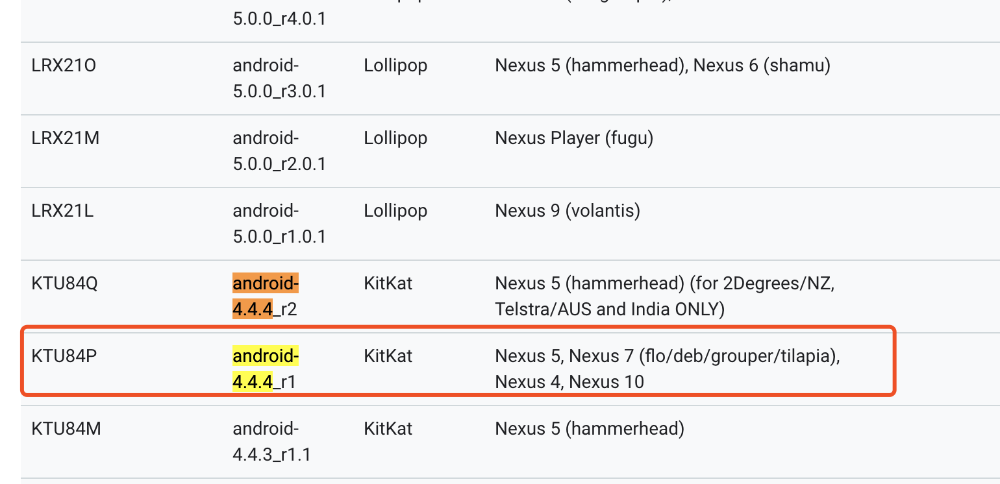
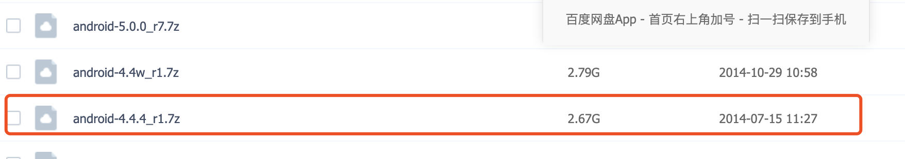
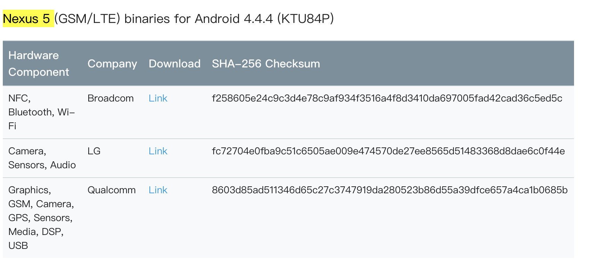
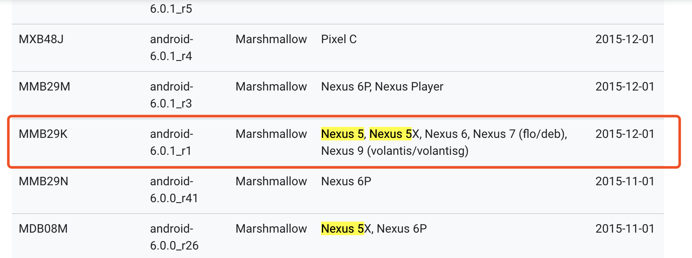
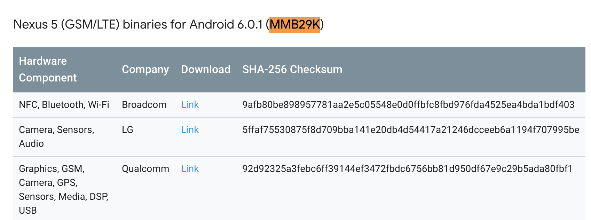
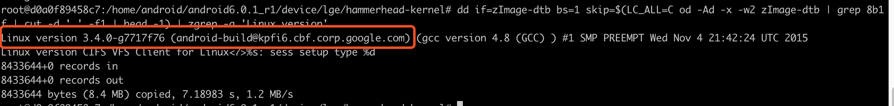

## Docker下编译多版本Android系统和内核

###  准备阶段

编译Android系统最好的是在Linux系统下,而我办公使用的电脑是Mac, Docker技术可以让我编译环境移植方便，所以我们使用docker下编译android源码和内核，我常用的测试机是Nexus5，所以我要为我的手机编译一个源码，定制一个自己Android系统。用于解决一些脱壳，反调试，查找本地代码位置，集成Xposed啥功能。这里编译两个Android系统版本，Dalivk 虚拟机的Android4.4.4 和ART虚拟机的Android6.0.1。


我们需要在Mac下创建一个大小写敏感的磁盘，用于Android源码即内核的编译

```shell
sudo hdiutil create -type SPARSE -fs 'Case-sensitive Journaled HFS+' -size 200g ~/android.dmg
```

我们添加如下命令到.bashrc 或者.zshrc 文件, 以后适应mountAndroid 和umounAndroid 来加载或者卸载这个磁盘

```shell
# mount the android file image
function mountAndroid { hdiutil attach ~/android.dmg.sparseimage -mountpoint /Volumes/android; }

# unmount the android file image
function umountAndroid() { hdiutil detach /Volumes/android; }
```


### 编译android4.4.4源码和内核

查看源码分支列表，确定下载aosp源码和源码分支代号https://source.android.google.cn/setup/build-numbers




下载Android4.4.4 的源码

```shell
# 这里我们不使用 git下载android源码，我们使用百度云盘好心人整理好的源码文件
https://pan.baidu.com/s/1ngsZs
```




下载源码分支KTU84P 驱动

 [https://developers.google.com/android/nexus/drivers#hikey](https://link.jianshu.com/?t=https://developers.google.com/android/nexus/drivers#hikey) 搜索KTU84P



下载Android内核源码

```shell
## 我们在Android4.4.4 源码目录下创建一个kernel目录，用于存放内核源码
cd /Voluems/android/android4.4.4
mkdir kernel
cd kernel
git clone https://aosp.tuna.tsinghua.edu.cn/kernel/msm.git
git checkout d59db4e 
```

checkout 当前手机内核提交分支号

```shell
cd /home/android/android4.4.4/device/lge/hammerhead-kernel
dd if=zImage-dtb bs=1 skip=$(LC_ALL=C od -Ad -x -w2 zImage-dtb | grep 8b1f | cut -d ' ' -f1 | head -1) | zgrep -a 'Linux version'
```

结果如下,我们看到我们内核版本是3.4.0 提交版本号d59db4e


```shell
git checkout d59db4e
```


使用以下命令创建一个容器，并挂载 ~/share 目录到容器中的 /home/share 目录：

```shell
$ docker run --privileged  -it -v /Volumes/android:/home/android unbuntu14.04 /bin/bash
```

开始在容器开始工作

```shell
#备份软件源配置 /etc/apt/sources.list  到 /etc/apt/sources.list.bak
cp /etc/apt/sources.list /etc/apt/sources.list.bak

#添加如下软件源到 /etc/apt/sources.list
deb http://mirrors.aliyun.com/ubuntu/ trusty main restricted universe multiverse
deb http://mirrors.aliyun.com/ubuntu/ trusty-security main restricted universe multiverse
deb http://mirrors.aliyun.com/ubuntu/ trusty-updates main restricted universe multiverse
deb http://mirrors.aliyun.com/ubuntu/ trusty-proposed main restricted universe multiverse
deb http://mirrors.aliyun.com/ubuntu/ trusty-backports main restricted universe multiverse
deb-src http://mirrors.aliyun.com/ubuntu/ trusty main restricted universe multiverse
deb-src http://mirrors.aliyun.com/ubuntu/ trusty-security main restricted universe multiverse
deb-src http://mirrors.aliyun.com/ubuntu/ trusty-updates main restricted universe multiverse
deb-src http://mirrors.aliyun.com/ubuntu/ trusty-proposed main restricted universe multiverse
deb-src http://mirrors.aliyun.com/ubuntu/ trusty-backports main restricted universe multiverse

#更新镜像源
sudo apt-get update

#安装编译支持库
apt-get install lib32z1 lib32ncurses5 lib32bz2-1.0
apt-get install gcc-multilib g++-multilib build-essential
apt-get install git-core gnupg bison flex gperf pngcrush bc zip curl lzop 
apt-get install schedtool libxml2 libxml2-utils xsltproc squashfs-tools 
apt-get install libesd0-dev libsdl1.2-dev libwxgtk2.8-dev libswitch-perl 
apt-get install libssl1.0.0 libssl-dev lib32readline-gplv2-dev libncurses5-dev

#安装JDK
sudo apt-get install openjdk-7-jdk
#修改 ~/.bashrc文件，添加如下内容：
export JAVA_HOME=/usr/lib/jvm/java-7-openjdk-amd64
export JAVA_BIN=$JAVA_HOME/bin
export JAVA_LIB=$JAVA_HOME/lib
export CLASSPATH=$JAVA_LIB/tools.jar:$JAVA_LIB/dt.jar
export PATH=$JAVA_BIN:$PATH


#Docker容器的
sudo  dd if=/dev/zero of=/swap bs=1G count=4   //4GB
sudo mkswap /opt/swapfile  //转换成swap类型文件
sudo swapon /opt/swapfile  //使能swap功能

# 	为了每次开机使能
sudo vim /etc/fstab    
增加： /opt/swapfile swap swap defaults 0 0

#开始编译Nexus Android4.4.4的内核
$export ANDROID_SRC_PATH=/home/android/android4.4.4
$export PATH=$ANDROID_SRC_PATH/prebuilts/gcc/linux-x86/arm/arm-eabi-4.6/bin:$PATH 
$export ARCH=arm
$export SUBARCH=arm
$export CROSS_COMPILE=arm-eabi-
##配置
make hammerhead_defconfig
##编译
make
##终端输出：Kernel: arch/arm/boot/zImage-dtb is ready 编译完成

#开始编译AOSP源码
cd /home/android 
source build/envsetup.sh
lunch 12
make -j8

# 提交保存Docker镜像
$ sudo docker commit -m "docker_android4_4_4" 1a61adfb1953 local:v1.0
$ docker run -it -v /Volumes/android:/home/android  docker_android4_4_4 /bin/bash
```

### 编译android6.0.1源码和内核

查看源码分支列表，确定下载aosp源码和源码分支代号https://source.android.google.cn/setup/build-numbers



下载Android6.0.1_r1 的源码

```shell
# 这里我们不使用 git下载android源码，我们使用百度云盘好心人整理好的源码文件
https://pan.baidu.com/s/1ngsZs
```


下载源码分支MMB29K 驱动

 [https://developers.google.com/android/nexus/drivers#hikey](https://link.jianshu.com/?t=https://developers.google.com/android/nexus/drivers#hikey) 搜索MMB29K



下载Android内核源码

```shell
## 我们在Android6.0.1_r1 源码目录下创建一个kernel目录，用于存放内核源码
cd /Voluems/android/android6.0.1_r1
mkdir kernel
cd kernel
git clone https://aosp.tuna.tsinghua.edu.cn/kernel/msm.git
```

checkout 当前手机内核提交分支号

```shell
dd if=/home/android/android6.0.1_r1/device/lge/hammerhead-kernel/zImage-dtb bs=1 skip=$(LC_ALL=C od -Ad -x -w2 zImage-dtb | grep 8b1f | cut -d ' ' -f1 | head -1) | zgrep -a 'Linux version'
```

结果如下,我们看到我们内核版本是3.4.0 提交版本号7717f76



```shell
cd msm
git checkout 7717f76
```

开始编译

```shell
# 使用编译
$ docker run --privileged  -it -v /Volumes/android:/home/android docker_android4_4_4:v1.0 /bin/bash 
#配置JDK
sudo apt-get install openjdk-7-jdk

#添加如下到.bashrc
export JAVA_HOME=/usr/lib/jvm/java-7-openjdk-amd64
export JAVA_BIN=$JAVA_HOME/bin
export JAVA_LIB=$JAVA_HOME/lib
export CLASSPATH=$JAVA_LIB/tools.jar:$JAVA_LIB/dt.jar
export PATH=$JAVA_BIN:$PATH


#开始编译Nexus Android6.0.1的内核
export ANDROID_SRC_PATH=/home/android/android6.0.1_r1
export PATH=$ANDROID_SRC_PATH/prebuilts/gcc/linux-x86/arm/arm-eabi-4.8/bin:$PATH 
export ARCH=arm
export SUBARCH=arm
export CROSS_COMPILE=arm-eabi-
##配置
make hammerhead_defconfig
##编译
$make
##终端输出：Kernel: arch/arm/boot/zImage-dtb is ready 编译完成

#开始编译AOSP源码
export TARGET_PREBUILT_KERNEL=$ANDROID_SRC_PATH/kernel/msm/arch/arm/boot/zImage-dtb

cd /home/android 
source build/envsetup.sh
lunch 19
make -j8

# 提交保存Docker镜像
$ sudo docker commit -m "docker_android4_4_4" 1a61adfb1953 local:v1.0
$ docker run -it -v /Volumes/android:/home/android  docker_android4_4_4 /bin/bash
```

