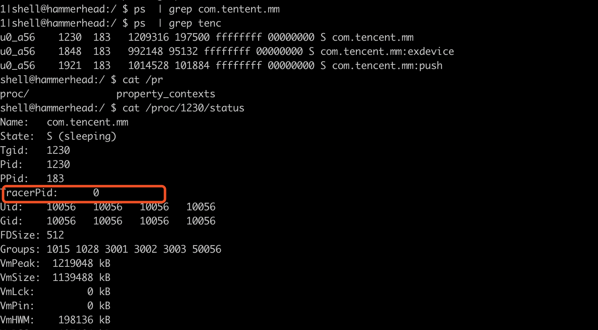
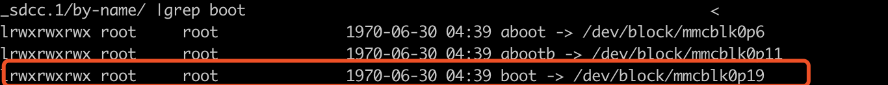
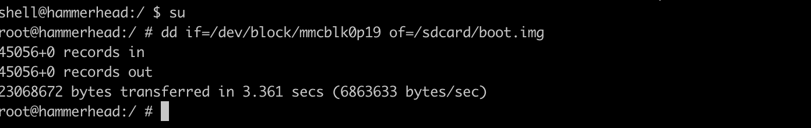
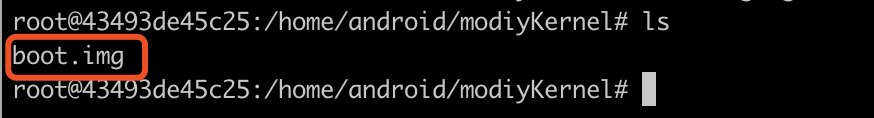
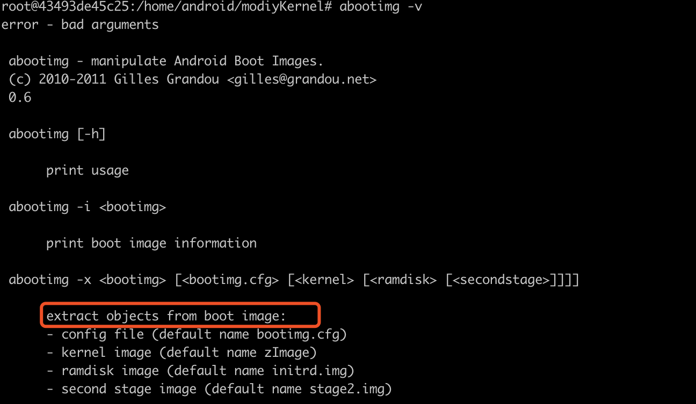
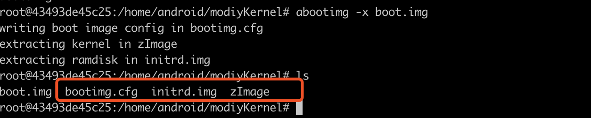
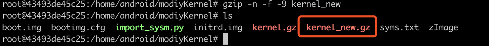
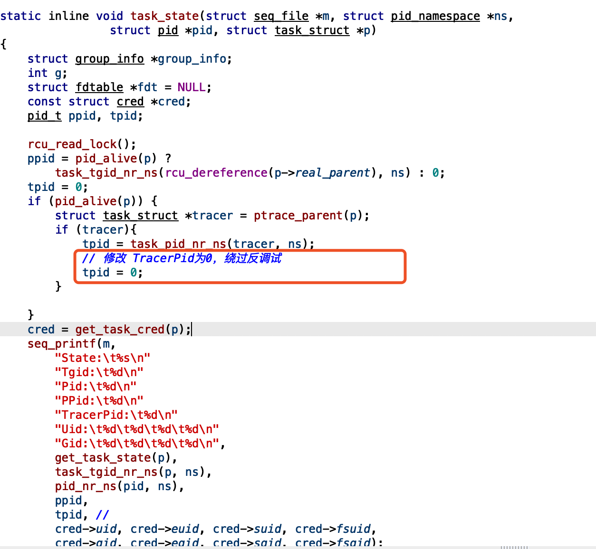

## 修改Android 内核绕过TracePid反调试

逆向修改指的是从手机中提取Android内核镜像，修改后，替换原来的镜像的方式。这里以nexus5 为例, 这里只介绍在修改中遇到一些技术， 我们不推荐这种方式。我们推荐使用Android 内核重新编译方式来实现，这种方式修改简单。

### TracePid 反调试原理

通过读取进程状态 获取TracerPID的值， 如果这个值为0 则代表这个进程没有被调试，不为0 则表示调试器进程id



代码检测

``` c
char file [PATH_LEN];
char line [LINE_LEN];
snprintf (file, PATH_LEN-1, "/proc/%d/status", pid);    
FILE *fp = fopen (file, "r"); 
while (fgets (line, LINE_LEN-1, fp)) {
        if (strncmp (line, "TracerPid:", 10) == 0) {
            if (0 != atoi (&line[10])) {
                /* encrypt random .TEXT code */
            }
            break;
        }
}
fclose (fp);
```


###逆向修改

#### 1.手机设备环境

```shell
Model number: Nexus 5
OS Version: Android 4.4.4 KTU84P
Kernel Version: 3.4.0-gd59db4e
```

#### 2.提取Android内核

android 的内核保存在boot分区，nexus5使用的高通芯片，可以使用如下命令可以提取boot分区镜像 

```shell
ls -al /dev/block/platform/msm_sdcc.1/by-name
```



```shell
dd if=/dev/block/mmcblk0p19 of=/sdcard/boot.img
```



```shell
adb pull /sdcard/boot.img
```




#### 3.修改镜像

安装镜像修改工具abootimg

```
apt-get install build-essential abootimg  
```



解压boot.img

```
abootimg -x boot.img
```



拷贝zImage 为kernel.gz 并使用 WinHex 工具查找十六进制 1F 8B 08 00，找到之后把前面的数据部分全删掉，使kernel.gz文件变成标准的gzip压缩文件，这样子就可以使用  gunzip/gzip 命令进行解压内核文件了。


提取内核符号

```shell
cat /proc/sys/kernel/kptr_restrict  
# 关闭内核符号屏蔽  
echo 0 > /proc/sys/kernel/kptr_restrict     
# 查看修改后的值  
cat /proc/sys/kernel/kptr_restrict  
```

```shell
adb shell cat /proc/kallsyms > syms.txt
```

导入符号到IDA中 使用IDAPython 脚本

```python
ksyms = open("syms.txt")  
for line in ksyms:  
    addr = int(line[0:8],16)  
    name = line[11:]  
    idaapi.set_debug_name(addr,name)  
    MakeNameEx(addr,name,SN_NOWARN)
    Message("%08X:%s"%(addr,name))  
```

分析修改内核

重新打包生成boot.img

```
gzip -n -f -9 kern	el_new
```



添加之前 1F 8B 08 00 zImage 之前的数据到kernel_new.gz

重命名kernel_new.gz  

```
cp kernel_new.gz zImage_new
```

abootimg 生成新的镜像boot_new.img

```shell
abootimg --create boot_new.img -f bootimg.cfg -k zImage_new -r initrd.img
```


更新手机 boot.img 镜像

```
adb reboot bootloader
fastboot flash boot myboot.img
```


### 源码修改

#### 1. 下载Android内核源码 

```shell
git clone https://aosp.tuna.tsinghua.edu.cn/kernel/msm.git
git checkout d59db4e
```

#### 2. 修改内核源码 msm/proc/array.c




#### 3.编译内核

```shell
# 设置编译选项
export ANDROID_SRC_PATH=/home/android/android4.4.4
export PATH=$ANDROID_SRC_PATH/prebuilts/gcc/linux-x86/arm/arm-eabi-4.6/bin:$PATH
export ARCH=arm
export SUBARCH=arm
export CROSS_COMPILE=arm-eabi-
make hammerhead_defconfig
make -j4

# 指定新的内核
export TARGET_PREBUILT_KERNEL=/home/android/android4.4.4/kernel/msm/arch/arm/boot/zImage-dtb

# 编译运行
make bootimage
```

